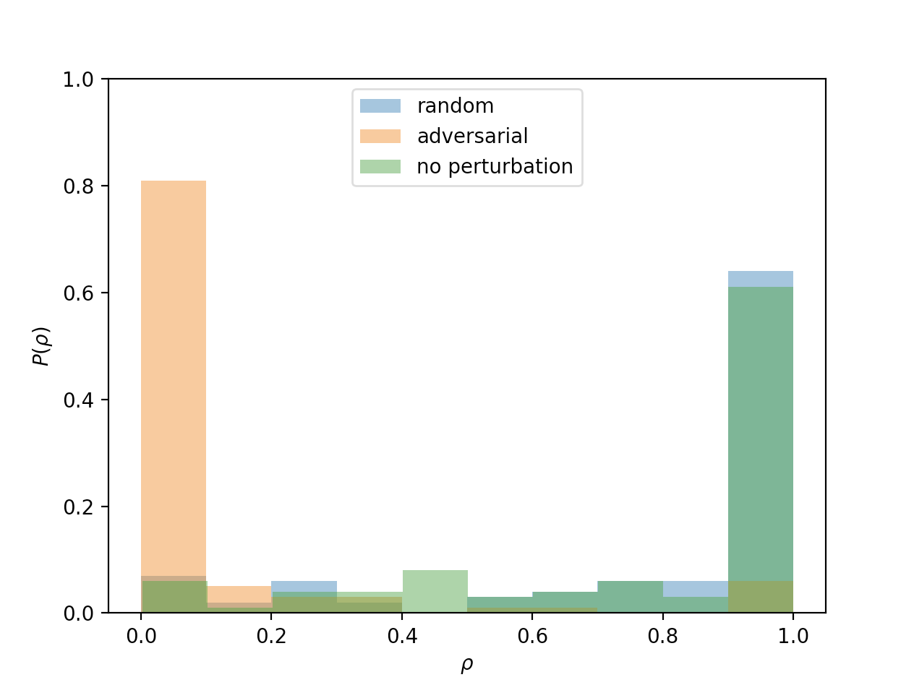

# AdvVoter
This repository contains data and code used in our study on *[Adversarial attacks on voter model dynamics in complex networks](https://arxiv.org/abs/2111.09561)*.

## Terms of use

MIT licensed. Happy if you cite our preprint when using the codes:

Chiyomaru K and Takemoto K (2021) Adversarial attacks on voter model dynamics in complex networks. arXiv:2111.09561.

## Usage
### Requirements
Python 3.9.7
```
pip install -r requirements.txt
```

### Vote model dynamics in model networks
e.g., in Erdos-Renyi networks
```
python run.py --network 'ER'
```

Note that $N=t_{\max}=400$, $\langle k \rangle = 6$, $\rho_{\mathrm{init}}=0.8$, and $\epsilon=0.01$ are in default configuration (see `run.py` for details).

$\rho$ distibutions for no perturbation (at $\epsilon=0$), adversarial attacks, and random attacks are displayed.



Note that each $\rho$ distribution is obtained from 100 realizations in default configuration (see `run.py` for details).


Watts-Strogatz model (`--network 'WS'`) and Barabasi-Albert model (`--network 'BA'`) are also available.

### Vote model dynamics in real-world networks
Note that it is time-consuming.

e.g., Facebook
```
python run.py --network 'facebook_combined'
```
Advogato (`--network 'soc-advogato'`), AnyBeat (`--network 'soc-anybeat'`), and HAMSTERster (`--network 'soc-hamsterster'`) networks are also available.
